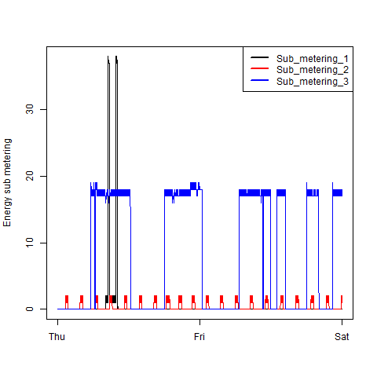
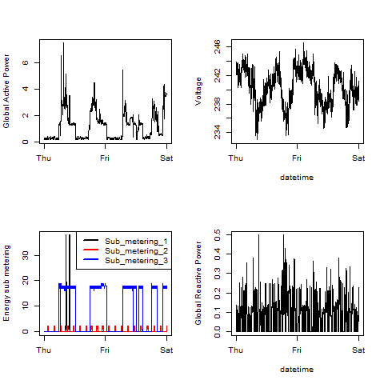

## Introduction

Repository for Project 1 of Coursera Class "Exploratory Data Analysis."

This assignment uses data from the <a href="http://archive.ics.uci.edu/ml/">UC Irvine Machine
Learning Repository</a>, a popular repository for machine learning datasets. In particular, 
this project will be using the "Individual household electric power consumption Data Set" which 
was made available on the course web site:

* <b>Dataset</b>: <a href="https://d396qusza40orc.cloudfront.net/exdata%2Fdata%2Fhousehold_power_consumption.zip">Electric power consumption</a> [20Mb]

* <b>Description</b>: Measurements of electric power consumption in one household with a 
one-minute sampling rate over a period of almost 4 years. Different electrical quantities 
and some sub-metering values are available.

The following descriptions of the 9 variables in the dataset are taken from the 
<a href="https://archive.ics.uci.edu/ml/datasets/Individual+household+electric+power+consumption">UCI 
web site</a>:

<ol>
<li><b>Date</b>: Date in format dd/mm/yyyy </li>
<li><b>Time</b>: time in format hh:mm:ss </li>
<li><b>Global_active_power</b>: household global minute-averaged active power (in kilowatt) </li>
<li><b>Global_reactive_power</b>: household global minute-averaged reactive power (in kilowatt) </li>
<li><b>Voltage</b>: minute-averaged voltage (in volt) </li>
<li><b>Global_intensity</b>: household global minute-averaged current intensity (in ampere) </li>
<li><b>Sub_metering_1</b>: energy sub-metering No. 1 (in watt-hour of active energy). It corresponds to the kitchen, containing mainly a dishwasher, an oven and a microwave (hot plates are not electric but gas powered). </li>
<li><b>Sub_metering_2</b>: energy sub-metering No. 2 (in watt-hour of active energy). It corresponds to the laundry room, containing a washing-machine, a tumble-drier, a refrigerator and a light. </li>
<li><b>Sub_metering_3</b>: energy sub-metering No. 3 (in watt-hour of active energy). It corresponds to an electric water-heater and an air-conditioner.</li>
</ol>

## Loading the data

When loading this dataset into R, please note the following:

* The dataset has 2,075,259 rows and 9 columns. 

* This project uses only data from the dates 2007-02-01 and 2007-02-02. 

* It was useful to convert the Date and Time variables to Date/Time classes in R using the 
`strptime()` and `as.Date()` functions.

* Note that, in this dataset, missing values are coded as `?`.

## Making Plots

The overall goal here was simply to examine how household energy usage varies over a 2-day 
period in February, 2007. The task was to reconstruct the following plots below, all of which 
were constructed using R's base plotting system.

For each plot, the task was to...

* Construct the plot and save it to a PNG file with a width of 480 pixels and a height of 480 pixels.

* Name each of the plot files as `plot1.png`, `plot2.png`, etc.

* Create a separate R code file (`plot1.R`, `plot2.R`, etc.) that constructs the corresponding 
plot, i.e. code in `plot1.R` constructs the `plot1.png` plot. The R code file **includes code 
for reading in the data** so that the plot can be fully reproduced. The provided R code also 
includes the code that creates the PNG file.

* Add the PNG file and R code file to this (my) Git repository.

The four plots that were constructed are shown below. 

### Plot 1

 

### Plot 2

 

### Plot 3

 

### Plot 4

 

